# 🚀 **Saidee Hasan** 
#### **AI-Driven Full Stack MERN Developer | Cybersecurity Specialist | Web Architect**

<p align="center">
  
</p>

<div align="center">
  
  
  
  
  
  
  
</div>

---

## 📊 **TECHNOLOGY STACK DASHBOARD**

### **🎯 CORE WEB TECHNOLOGIES**
<div align="center">
  
| **Category** | **Technologies** | **Proficiency** |
|--------------|------------------|-----------------|
| **Frontend** | React.js, Next.js, TypeScript, Tailwind CSS |  |
| **Backend** | Node.js, Express.js, Golang, REST APIs |  |
| **Database** | MongoDB, PostgreSQL, Prisma ORM, Mongoose |  |
| **DevOps** | Docker, Nginx, CI/CD, AWS, Firebase |  |
| **AI Tools** | Gemini AI, Jasper AI, OpenAI API, AI Automation |  |

</div>

---

## 🛠️ **COMPLETE SKILL SET**

### **🌐 CORE WEB DEVELOPMENT**
```yaml
Frontend Mastery:
  - HTML5 & Semantic Markup
  - CSS3 & Advanced Animations
  - Responsive Design (Flexbox, Grid)
  - Mobile-First Development
  - Progressive Web Apps (PWA)

JavaScript Ecosystem:
  - ES6+ Modern JavaScript
  - Async/Await & Promises
  - DOM Manipulation
  - Functional Programming
  - Module Systems
```

### **⚛️ REACT & FRONTEND STACK**
<div align="center">
  
</div>

```javascript
const frontendStack = {
  frameworks: ["React.js", "Next.js", "TypeScript"],
  styling: ["Tailwind CSS", "Styled Components", "SASS"],
  stateManagement: ["Redux", "Context API", "Zustand"],
  testing: ["Jest", "React Testing Library", "Cypress"],
  buildTools: ["Webpack", "Vite", "Babel"]
};
```

### **🔙 BACKEND & DATABASE**
<div align="center">
  
</div>

```javascript
const backendStack = {
  runtime: ["Node.js", "Express.js", "Golang"],
  databases: ["MongoDB", "PostgreSQL", "Redis"],
  orm: ["Prisma", "Mongoose", "Sequelize"],
  apis: ["REST API", "GraphQL", "WebSocket"],
  authentication: ["JWT", "OAuth2.0", "Passport.js"]
};
```

### **🤖 AI INTEGRATION & TOOLS**
```yaml
AI Capabilities:
  - Gemini AI Integration
  - Jasper AI for Text/Image Generation
  - OpenAI API Implementation
  - AI-powered Response Systems
  - Machine Learning Basics
  - Natural Language Processing

API Integrations:
  - Google Maps API
  - Payment Gateways (Stripe, PayPal)
  - Firebase Services
  - Email Services (Nodemailer, SendGrid)
  - Cloud Storage (AWS S3, Cloudinary)
```

### **🐳 DEVOPS & DEPLOYMENT**
<div align="center">
  
</div>

```yaml
Infrastructure:
  - Containerization with Docker
  - Reverse Proxy with Nginx
  - CI/CD Pipeline Setup
  - Server Management & Monitoring
  - Load Balancing
  - SSL/TLS Configuration
```

---

## 📈 **GITHUB ANALYTICS**

<div align="center">
  <table>
    <tr>
      <td>
        
      </td>
      <td>
        
      </td>
    </tr>
    <tr>
      <td colspan="2">
        
      </td>
    </tr>
  </table>
</div>

---

## 🚀 **PROJECT PORTFOLIO**

### **🎯 REAL-WORLD PROJECTS**

#### **🏦 Mobile Banking App Clone**
```yaml
Description: Full-featured banking application with modern UI/UX
Features:
  - User Authentication & Authorization
  - Account Management
  - Fund Transfer System
  - Transaction History
  - Secure Payment Processing
  - Real-time Notifications

Tech Stack:
  Frontend: React.js, TypeScript, Tailwind CSS
  Backend: Node.js, Express.js
  Database: MongoDB, Redis
  Security: JWT, Bcrypt, Helmet.js
  APIs: Payment Gateway, SMS Service
```

#### **🛒 E-commerce Platform**
```yaml
Description: Complete online shopping solution
Features:
  - Product Catalog with Filters
  - Shopping Cart System
  - User Reviews & Ratings
  - Order Management
  - Admin Dashboard
  - Payment Integration

Tech Stack:
  Frontend: Next.js, Redux Toolkit
  Backend: Node.js, Express.js
  Database: PostgreSQL, Prisma
  Payments: Stripe Integration
  Deployment: Docker, AWS
```

#### **🔐 Advanced Auth System**
```yaml
Description: Secure authentication system with multiple providers
Features:
  - Email/Password Authentication
  - Social Login (Google, GitHub)
  - Two-Factor Authentication
  - Password Reset Flow
  - Session Management
  - Role-based Access Control

Tech Stack:
  Frontend: React.js, Context API
  Backend: Node.js, Express.js
  Database: MongoDB
  Security: JWT, OAuth2.0, Bcrypt
  Services: Nodemailer, Firebase Auth
```

### **📁 PROJECT STRUCTURE**
```bash
fullstack-project/
├── client/                 # Frontend (React/Next.js)
│   ├── src/
│   │   ├── components/     # Reusable components
│   │   ├── pages/         # Application pages
│   │   ├── hooks/         # Custom hooks
│   │   ├── utils/         # Helper functions
│   │   └── styles/        # CSS/Tailwind styles
├── server/                 # Backend (Node.js/Express)
│   ├── src/
│   │   ├── controllers/   # Route controllers
│   │   ├── models/        # Database models
│   │   ├── routes/        # API routes
│   │   ├── middleware/    # Custom middleware
│   │   └── config/        # Configuration files
├── database/              # Database scripts/models
├── docker/               # Docker configuration
├── nginx/               # Nginx configuration
├── tests/               # Test files
├── .env.example         # Environment variables
├── docker-compose.yml   # Docker compose
└── README.md           # Project documentation
```

---

## 🏗️ **DEVELOPMENT WORKFLOW**

### **🔄 CI/CD PIPELINE**
```yaml
Development Workflow:
  1. Feature Branch Creation
  2. Code Development & Testing
  3. Pull Request & Code Review
  4. Automated Testing (Jest, Cypress)
  5. Build & Deployment
  6. Production Monitoring

Deployment Stack:
  - GitHub Actions for CI/CD
  - Docker for Containerization
  - Nginx as Reverse Proxy
  - AWS EC2 for Hosting
  - PM2 for Process Management
  - SSL via Let's Encrypt
```

### **🔧 DEVELOPMENT TOOLS**
<div align="center">
  
</div>

```yaml
Development Environment:
  IDE: VS Code with Extensions
  Version Control: Git & GitHub
  API Testing: Postman, Insomnia
  Database GUI: MongoDB Compass, DBeaver
  Design: Figma, Adobe XD
  Deployment: Vercel, Netlify, AWS
```

---

## 🎯 **CERTIFICATION ROADMAP**

### **📚 LEARNING PATH**

```mermaid
graph LR
    A[Core Web Fundamentals] --> B[Frontend Development]
    B --> C[Backend Development]
    C --> D[Database Management]
    D --> E[DevOps & Deployment]
    E --> F[AI Integration]
    F --> G[Cybersecurity]
    G --> H[Full Stack Mastery]
    
    style A fill:#61DAFB
    style B fill:#38B2AC
    style C fill:#339933
    style D fill:#4EA94B
    style E fill:#0078D4
    style F fill:#FF6B6B
    style G fill:#FFBD2E
    style H fill:#9F7AEA
```


### **🏆 TARGET CERTIFICATIONS**
- MongoDB University Certification
- AWS Certified Developer Associate
- React Developer Certification
- Node.js Services Developer
- Docker Certified Associate
- Cybersecurity Fundamentals

---

## 📊 **SKILL METRICS & PROGRESS**

<div align="center">

| **Skill Category** | **Current Level** | **Projects Completed** | **Target Mastery** |
|-------------------|-------------------|------------------------|-------------------|
| **React & Frontend** | 🟢 Advanced | 15+ | ⭐ Expert |
| **Node.js & Backend** | 🟢 Advanced | 12+ | ⭐ Expert |
| **Database Design** | 🟡 Intermediate+ | 10+ | 🟢 Advanced |
| **DevOps & Deployment** | 🟡 Intermediate+ | 8+ | 🟢 Advanced |
| **AI Integration** | 🟡 Intermediate | 5+ | 🟡 Intermediate+ |
| **Cybersecurity** | 🟡 Intermediate | 6+ | 🟢 Advanced |

</div>

---

## 🎨 **PROJECT SHOWCASE**

### **🌟 FEATURED PROJECTS**

<table>
<tr>
<td width="50%">

#### **🎯 [ElectroPoll](https://github.com/saidee-hasan/electropoll)**
**Secure Voting Platform**
```bash
Status: Live Production
Stack: MERN + Socket.io + AI
Features:
✓ Real-time Voting
✓ Secure Authentication
✓ AI-powered Analytics
✓ Admin Dashboard
✓ Mobile Responsive
```

</td>
<td width="50%">

#### **🛡️ [CyberAuth](https://github.com/saidee-hasan)**
**Advanced Auth System**
```bash
Status: In Development
Stack: Next.js + Node.js + MongoDB
Features:
✓ Multi-factor Auth
✓ Social Login
✓ Session Management
✓ Security Monitoring
✓ Rate Limiting
```

</td>
</tr>
<tr>
<td width="50%">

#### **🛒 [ShopSphere](https://github.com/saidee-hasan)**
**E-commerce Platform**
```bash
Status: Planning Phase
Stack: Next.js + PostgreSQL + Stripe
Features:
✓ Product Management
✓ Shopping Cart
✓ Payment Processing
✓ Order Tracking
✓ Admin Panel
```

</td>
<td width="50%">

#### **🏦 [FinTech App](https://github.com/saidee-hasan)**
**Banking Application**
```bash
Status: Development
Stack: React + Node.js + MongoDB
Features:
✓ Account Management
✓ Fund Transfer
✓ Transaction History
✓ Security Features
✓ Mobile Banking
```

</td>
</tr>
</table>

---

## 📞 **CONNECT WITH ME**

<div align="center">

### **🌐 PROFESSIONAL NETWORK**
[](https://saidee-hasan.netlify.app)
[](https://linkedin.com/in/saidee-hasan)
[](https://github.com/saidee-hasan)
[](mailto:saidee.hasan.dev@gmail.com)
[](https://twitter.com/saidee_dev)

### **📱 QUICK LINKS**
```bash
# Connect via Terminal
$ connect saidee-hasan --social

Available Platforms:
1. Portfolio: https://saidee-hasan.netlify.app
2. GitHub: https://github.com/saidee-hasan
3. LinkedIn: https://linkedin.com/in/saidee-hasan
4. Email: saidee.hasan.dev@gmail.com
5. Twitter: @saidee_dev

# Open for collaborations and projects!
```

</div>

---

## 📊 **GITHUB CONTRIBUTIONS**

<div align="center">
  
</div>

---

## 🏆 **ACHIEVEMENTS & STATS**

<div align="center">
  
  
  
  
  
  
  **📈 Continuous Learner | 🚀 Project Builder | 🔒 Security Advocate**
  
</div>

---

<div align="center">
  
  ### **💡 DEVELOPMENT PHILOSOPHY**
  ```bash
  # My Coding Principles
  1. Write Clean, Maintainable Code
  2. Implement Security-First Approach
  3. Focus on Performance Optimization
  4. Prioritize User Experience
  5. Continuous Learning & Improvement
  6. Open Source Contribution
  ```
  
  <sub>✨ "Building the web, one line of code at a time"</sub>
  <br/>
  <sub>Last Updated: $(date +"%Y-%m-%d %H:%M:%S")</sub>
  
</div>
```
